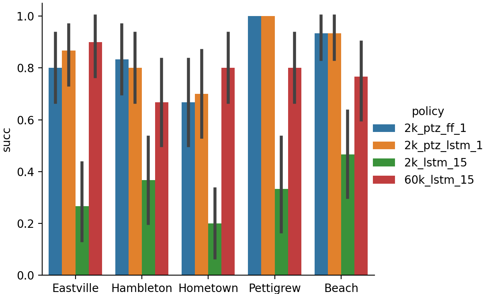
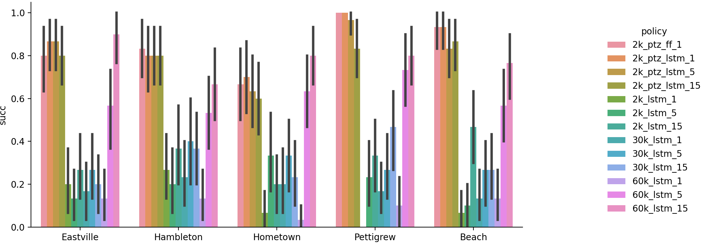
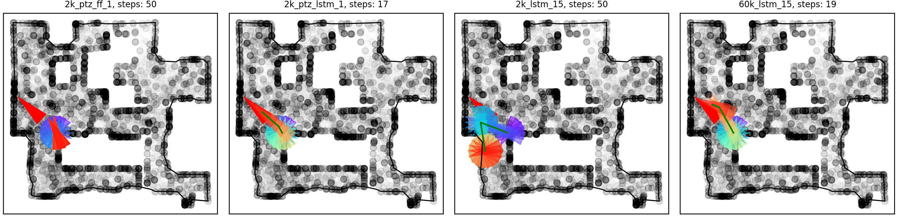
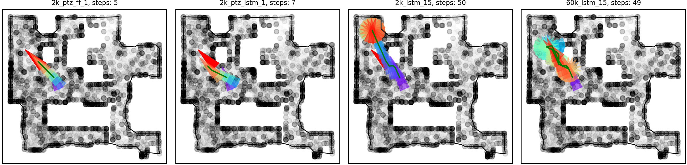
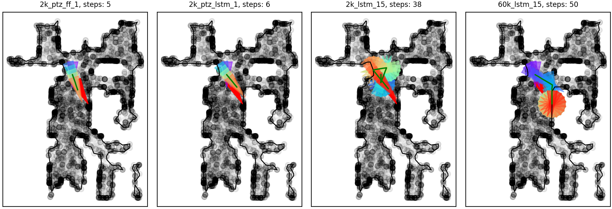
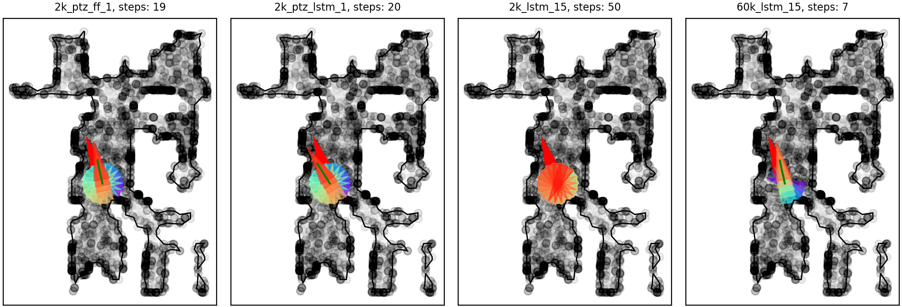

## Dependency
1. PerceptualSimilarity
2. CoordConv
3. requirements.py

## Generate training data (natural home images) for PTZ module

1. Download Gibson `.glb` files and store them in a folder called `gibson`
2. To generate habitat dataset to train PTZ module, run `./gen_ptz_data.sh < train/test_env.txt` inside `scripts/gen_data`
3. Folders `habitat_train` and `habitat_test` should now have 6500 images and 2300 images in total respectively from different environments. We sample 10 locations from each environment and generate 10 images at each location via consecutive right turns.

## Generate training data (noise images) for PTZ module

1. To generate noise dataset to train PTZ module, run `./gen_noise_data.sh` inside `scripts/gen_data`
2. Folders `noise_train` and `noise_test` should now have 40k and 4k images in total respectively. Both contain 4 folders corresponding to fractal noise, perlin noise, overlaping random shapes and non-overlaping random shapes. 

## Train PTZ module

1. Call `train_noise.py` to train the PTZ module
2. Training with habitat home images gives on_target_rate 99.1% +/- 0.1%, iou 96.4% +/- 0.0%
3. Training with random noise images gives on_target_rate 93.5% +/- 0.4%, iou 92.4% +/- 0.4%

## Generate training data for navigation policy

1. Run `./gen_nav_data.sh`
2. `nav_train` contains 10 environments, each has 1k validation data in `nav0` and 5k training data in `nav1`
3. 

## Run inference in testing environments

1. Build a target environment floor map by first randomly exploring the the space via `gen_ptz_data.sh`. 
2. Generate a scatter plot of all the valid locations via `load_all_states` from `nav.py`
3. Contour a floor map using a concave hull algorithm via `load_floor` from `nav.py`
4. 

## Evaluation 

| interaction data |FFNN w/o PTZ |LSTM w/o PTZ |FFNN w/ PTZ |LSTM w/ PTZ|
|------------------|-------------|-------------|------------|-----------| 
| 1k               |             |             | 70%        | 10%       |
| 25k              |             | 60%         |            |           |
| 50k              |             | 70%         |            |           |

### Sample trajectories

